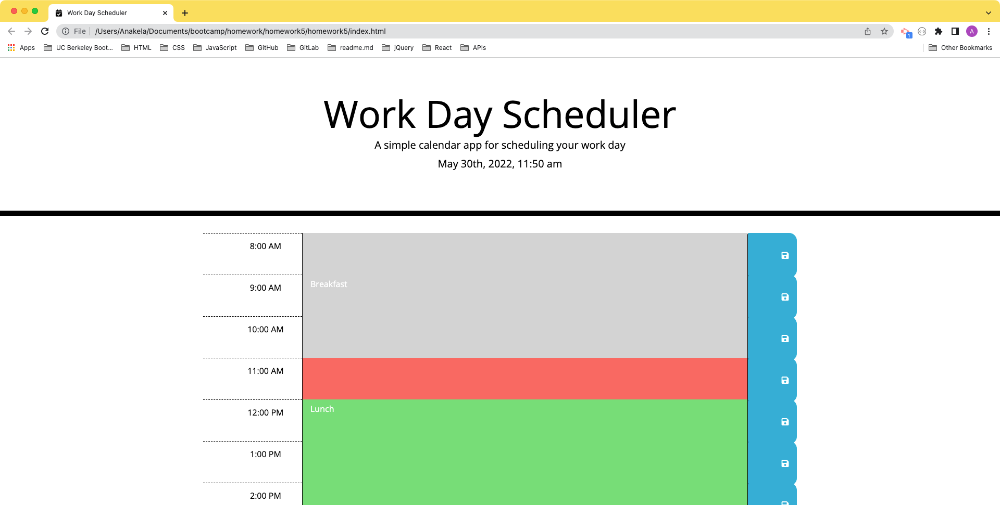
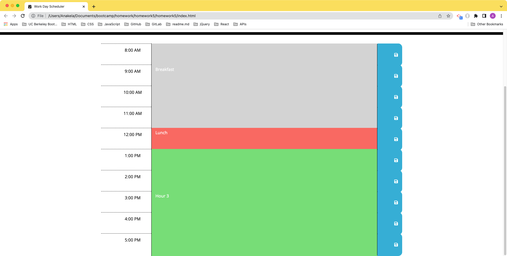

# Homework 5: 

## Table of Contents

- [Overview](#overview)
  - [The Challenge](#the-challenge)
  - [User Story](#user-story)
  - [Acceptance Criteria](#acceptance-criteria)
  - [Screenshot](#screenshot)
  - [Links](#links)
- [My Process](#my-process)
  - [Built With](#built-with)
  - [What I Learned](#what-i-learned)
  - [Continued Development](#continued-development)
  - [Useful Resources](#useful-resources)
- [Author](#author)
- [Acknowledgments](#acknowledgments)

## Overview

### The Challenge

> Create a simple calendar application that allows a user to save events for each hour of the day. This app will run in the browser and feature dynamically updated HTML and CSS powered by jQuery.

> The starter code uses the Moment.js (Links to an external site.) library to work with date and time, but feel free to use a different JavaScript solution to handle this functionality since [Moment.js](https://courses.bootcampspot.com/courses/1693/assignments/26729?module_item_id=537732#:~:text=Create%20a%20simple,project%20status%20page.) is considered a "legacy" project. Learn more about some alternative solutions in the [Moment.js project status page](https://courses.bootcampspot.com/courses/1693/assignments/26729?module_item_id=537732#:~:text=Create%20a%20simple,project%20status%20page.).

> #### IMPORTANT
> Make sure to clone the starter code repository and make your own repository with the starter code. Do not fork the starter code repository!

> Before you start, clone the [starter code](https://github.com/coding-boot-camp/super-disco).

### User Story

```
AS AN employee with a busy schedule
I WANT to add important events to a daily planner
SO THAT I can manage my time effectively
```

### Acceptance Criteria

```
GIVEN I am using a daily planner to create a schedule
WHEN I open the planner
THEN the current day is displayed at the top of the calendar
WHEN I scroll down
THEN I am presented with time blocks for standard business hours
WHEN I view the time blocks for that day
THEN each time block is color-coded to indicate whether it is in the past, present, or future
WHEN I click into a time block
THEN I can enter an event
WHEN I click the save button for that time block
THEN the text for that event is saved in local storage
WHEN I refresh the page
THEN the saved events persist
``` 

### Screenshot




### Links

- Solution URL: [https://github.com/anakela/work-day-scheduler](https://github.com/anakela/work-day-scheduler)
- Live Site URL: [https://anakela.github.io/work-day-scheduler/](https://anakela.github.io/work-day-scheduler/)

## My Process

### Built With

- Semantic HTML5 Markup
- CSS
- JavaScript
- jQuery
- Moment.js
- Bootstrap
- Font Awesome

### What I Learned


### Continued Development


### Useful Resources

- [Stack Overflow: Live Clock Moment.js](https://stackoverflow.com/questions/66648322/live-clock-moment-js)
- [Stack Overflow: Use Font Awesome Icon As Favicon](https://stackoverflow.com/questions/18156240/use-font-awesome-icon-as-favicon)
- [MDN Web Docs: Storage.getItem()](https://developer.mozilla.org/en-US/docs/Web/API/Storage/getItem)
- [Font Awesome Icon Downloader](https://gauger.io/fonticon/)
- [jQuery: .text()](https://api.jquery.com/text/)
- [jQuery: Category: Selectors](https://api.jquery.com/category/selectors/)
- [jQuery: .each()](https://api.jquery.com/each/)
- [Font Awesome](https://fontawesome.com/)

## Author

- LinkedIn - [@anakela](https://www.linkedin.com/in/anakela/)
- GitHub - [@anakela](https://github.com/anakela)

## Acknowledgments

- Fellow Bootcampers:
  - Nifer Kilakila
  - Ivy Chang
  - Nolan Spence
  - Michael Barrett
  - Kevin Muehlbauer
- Bobbi Tarkany (Tutor)
- AskBCS Slack Channel
